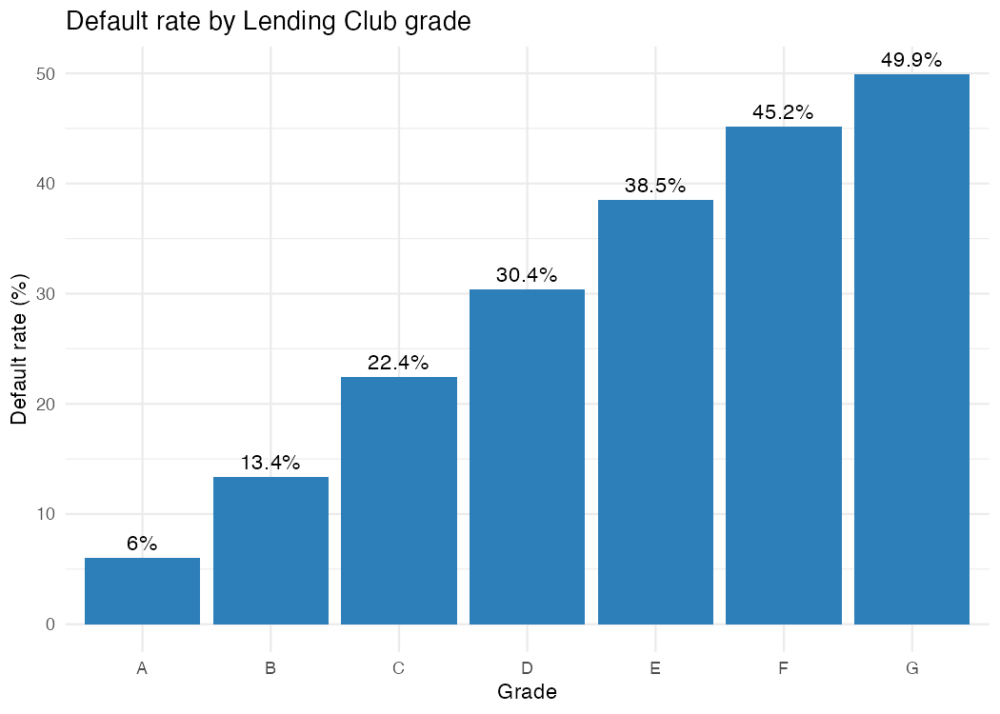
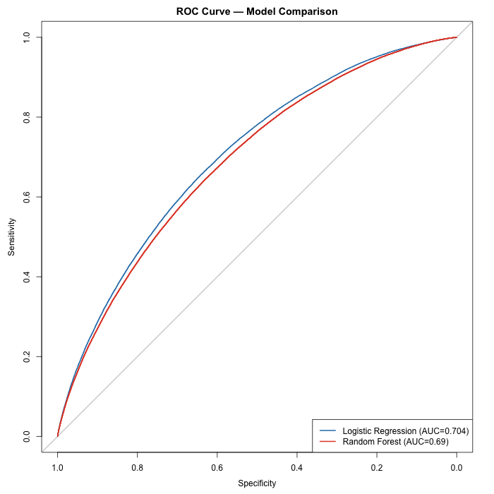
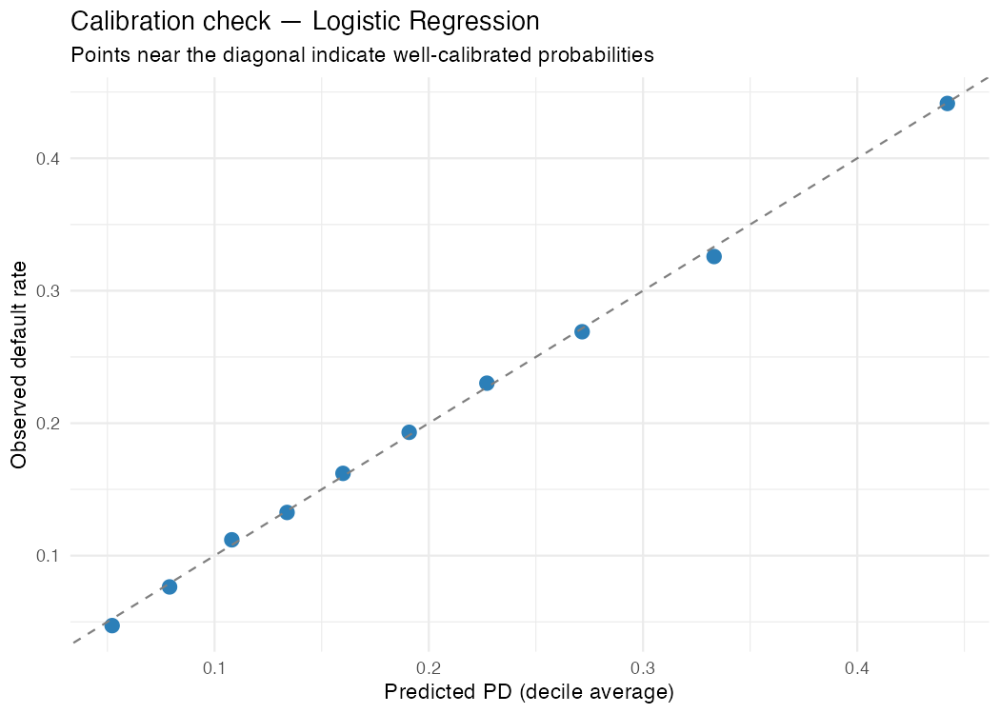
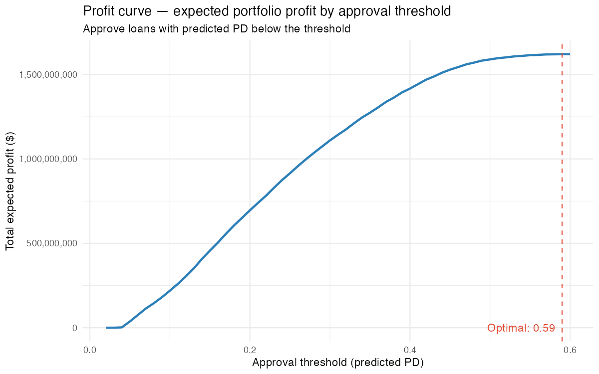
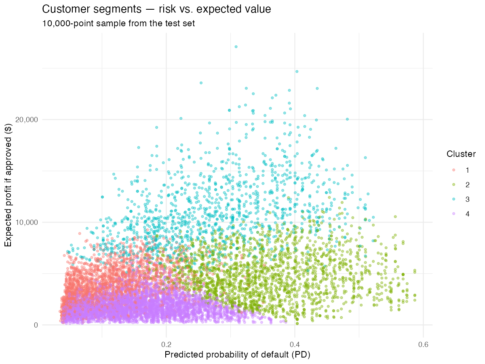

# Customer Risk & Value Segmentation

Interactive dashboard for credit risk assessment and customer segmentation, featuring a threshold simulator that estimates the economic impact of loan approval decisions. Built in R (analysis + modeling) and Shiny (dashboard), on real Lending Club data.

**🔗 Live demo:** [credit-risk-dashboard.shinyapps.io](https://margheritaarena.shinyapps.io/credit-risk-dashboard/)
**📊 Dataset:** [Lending Club Loan Data](https://www.kaggle.com/datasets/wordsforthewise/lending-club) (Kaggle)

---

## The problem

Given a new loan applicant, what is the probability of default, and what is the optimal decision (approve / reject / price the risk) considering the economic cost of the error, not just the model's statistical accuracy?

## Why this project

Traditional classification models stop at accuracy or AUC. This project goes further: it translates the probability of default into an **economic decision**, estimating Expected Loss and optimizing the approval threshold based on expected profit, not just model performance.

---

## Data

| | |
|---|---|
| Source | Lending Club Loan Data (Kaggle, `wordsforthewise/lending-club`) |
| Period | 2007–2018 |
| Original rows | 2,260,701 |
| Rows after filtering final outcomes (Fully Paid / Charged Off) | 1,345,310 |
| Columns after dropping >40% missing | 94 |
| Final dataset rows (after Phase 1 cleaning) | 1,345,310 |
| Final dataset rows (after Phase 2 domain-specific quality checks, used for modeling) | 1,344,377 |
| Default rate | 20.0% |

## Methodology

### 1. Data Cleaning
- Filtered on final loan outcomes (Fully Paid / Charged Off), excluding transitory states (e.g. "Current") to avoid data leakage
- Removed columns with more than 40% missing values
- Imputation: median for numeric variables, "Unknown" category for categorical variables
- **Systematic outlier detection**: computed `pct_outliers` (IQR method) and skewness for all numeric variables, with winsorizing applied only to variables above threshold (>2% outliers); a data-driven decision rather than a manual/arbitrary one

> **Methodological note:** data cleaning is split across two phases. Phase 1 applies generic, domain-agnostic treatments (missing values, statistical outliers via IQR). Phase 2 applies domain-specific validation on the predictors selected for modeling (e.g. plausible thresholds for DTI, income, credit utilization) issues that only surfaced during targeted inspection of the variables entering the scorecard.

### 2. Feature Engineering
- Derived variables: `loan_to_income`, cleaned `revol_util`, bucketed `employment_stability`
- **Domain-specific data quality validation** on candidate predictors (`dti`, `annual_inc`, `revol_util`): identified implausible/sentinel values (e.g. `dti` up to 999, `revol_util` up to 892%) not documented in Lending Club's official data dictionary, and dropped the affected rows (~0.1% of the dataset combined) rather than imputing them, given the dataset's size
- Rare categories in `home_ownership` (`ANY`, `NONE`, `OTHER`) merged into a single bucket to avoid unstable WOE bins
- WOE (Weight of Evidence) and IV (Information Value) computed with the `scorecard` package for systematic, data-driven variable selection

**Predictor selection process (21 → 8 final predictors):**

| Stage | Predictors | What was removed and why |
|---|---|---|
| 1. First pass | 21 | Starting set of candidate variables (excluding IDs, dates, free text, and post-outcome fields such as `recoveries`/`total_pymnt` that would leak the target) |
| 2. Low IV | 21 → 15 | Removed `emp_length_years`/`employment_stability`, `open_acc`, `total_acc` (IV < 0.02); `delinq_2yrs`, `pub_rec` automatically dropped by `woebin()` as near-constant (>98% zeros) |
| 3. Multicollinearity | 15 → 11 | Removed `installment` (corr. 0.957 with `loan_amnt`, near-duplicate) and `grade`/`int_rate` (redundant with `sub_grade`, which explains most of their variance) |
| 4. IV recheck | 11 → 9 | Removed `purpose` and `revol_bal`, both IV < 0.02 |

**Methodological note:** a discrepancy was found between `iv()` and `woebin()` in the `scorecard` package, when called independently on the same data, they can produce different bin breakpoints for continuous variables (categorical variables were largely unaffected). This caused `revol_bal`'s IV to appear as 0.175 (medium predictor) under `iv()`'s own binning, while the binning actually used downstream (via the `bins` object powering `woebin_ply` and all plots) showed its true IV at just 0.004, a 45× difference. Since `iv()` does not accept custom breakpoints, the final IV values were extracted directly from the `bins` object (`total_iv` column) to guarantee consistency between the reported predictive power and the binning actually applied to the model.

Final predictors: `loan_amnt`, `term`, `sub_grade`, `annual_inc`, `verification_status`, `dti`, `revol_util`, `loan_to_income`, `home_ownership`.

### 3. EDA
- **Target overview**: confirmed 80/20 class balance (Fully Paid / Charged Off), consistent with Phase 1
- **Default rate by grade**: clean monotonic increase from 6.0% (grade A) to 49.9% (grade G), confirming `sub_grade`'s high IV (0.457) at the aggregate level. Grade G represents only ~0.7% of all loans, Lending Club's own risk filtering already screens out most high-risk applicants upstream
- **Correlation check**: confirmed no residual multicollinearity among the final numeric predictors (max correlation 0.57, between `loan_amnt` and `loan_to_income`, expected by construction, since the latter is derived from the former)
- **Default rate over time**: required two corrections before the trend was trustworthy:
  1. *Right-censoring bias*: the raw quarterly default rate collapsed toward 0% in the most recent quarters, an artifact of the Phase 1 filter (only final-outcome loans are kept, loans still "Current" are excluded). Recent vintages left in the dataset are a biased, fast-resolving subset (mostly early payoffs), not representative of that issuance quarter. Corrected by excluding loans issued in the last 24 months of the dataset's range.
  2. *Small-sample noise*: the earliest quarters (2007) had as few as 1–169 loans, too small to produce a reliable default rate. Corrected with a minimum sample size threshold (n ≥ 500 per quarter).
  
  The corrected trend shows a low default rate around 2009–2010 (Lending Club's early, highly selective lending period), a gradual rise through 2013, and a marked structural increase from mid-2016 onward (~20% → ~26%) that persists through the end of the observable period, a pattern worth flagging as context, even though it wasn't incorporated as a model feature at this stage.



### 4. Modeling
- **Train/test split**: 70/30, stratified on `default` (20.0% train, 19.9% test, balance preserved)
- **Methodological note — avoiding leakage in WOE binning**: Phase 2's WOE bins were computed on the full cleaned dataset, since no train/test split existed at that stage. Reusing those bins here would leak test-set information into the training data (bin boundaries and WOE values would have been influenced by observations later used for evaluation). WOE bins were therefore refit on the training set only, then applied identically to the test set, IV values on the training set alone (`sub_grade` 0.455, `term` 0.174, ...) closely matched the full-dataset IV from Phase 2, confirming the training sample is representative
- **Two models compared**: Logistic Regression on WOE-transformed variables (standard in banking scorecards, interpretable, monotonic, regulator-friendly) vs. Random Forest (`ranger`) on raw variables

| Model | AUC | Gini | KS |
|---|---|---|---|
| **Logistic Regression (WOE)** | **0.704** | **0.407** | **0.296** |
| Random Forest | 0.690 | 0.381 | 0.274 |
| `sub_grade` only (LC benchmark) | 0.690 | 0.380 | — |

- **Logistic regression was selected as the primary model** going forward: it slightly outperforms both the Random Forest and Lending Club's own `sub_grade` rating, and is more interpretable, a relevant factor in a banking/regulatory context. The result is consistent with the nature of the signal: WOE binning already renders predictor-target relationships largely monotonic and linear, reducing the structural advantage a non-linear model like Random Forest would otherwise have
- **Variable importance discrepancy**: the Random Forest's impurity-based importance ranks `sub_grade` only 5th, apparently contradicting its dominant IV (0.455) and largest logistic regression coefficient. This is a known bias of impurity-based importance, which favors continuous variables with many possible split points (`dti`, `revol_util`) over categorical variables with fewer categories, not evidence that `sub_grade` is actually less predictive. Noted as a possible extension: permutation importance would likely give a picture more consistent with the IV ranking
- **Calibration check**: predicted probabilities are well-calibrated, across all 10 deciles of predicted PD, the gap versus the observed default rate on the test set never exceeds 1 percentage point (e.g. highest-risk decile: 44.2% predicted vs. 44.1% observed). This confirms the predicted probabilities are reliable in absolute terms, not just for ranking, a necessary condition for the Expected Loss calculation in the next phase

<p float="left">
  
  
</p>

### 5. From model to economic decision
- **Recovering economic columns for the test set**: the risk model (Phase 4) only used 9 WOE-transformed predictors, excluding raw fields like `int_rate` needed here for revenue calculation (not a leakage concern, `int_rate` doesn't feed back into the PD model, only into the profit layer built on top of it). The train/test split was reproduced with the same seed on a superset of columns, and verified to match the Phase 4 test set exactly (identical row count and `default` vector) before merging
- **LGD (Loss Given Default)**: estimated empirically from the training set's charged-off loans only (`loss_amount = funded_amnt - total_pymnt`), giving a portfolio-average LGD of **0.468**. LGD increases mildly but monotonically with risk grade (0.453 for grade A to 0.517 for grade G), a single portfolio-average value was used as a simplifying assumption, since the spread across grades (~6-7 points) is modest
- **EAD (Exposure at Default)**: approximated as the full funded loan amount, the standard simplification for an approval-time model, since a repayment schedule doesn't exist yet at the point of decision
- **Expected Loss** (PD × LGD × EAD): averaged $1,456 per loan on the test portfolio, ranging from ~$15 to ~$11,000 depending on risk and loan size; **$588M** in aggregate expected loss if every test-set loan were approved
- **Expected profit per loan**: (1−PD) × expected interest income, PD × LGD × EAD, using a simplified total-interest-over-term revenue estimate. Median expected profit was positive ($2,844), though a minority of loans (min: −$3,310) had negative expected profit, the segment a well-calibrated approval threshold should screen out
- **Cost matrix**: approving a defaulting borrower (false negative) is far costlier in absolute terms than rejecting a reliable one (false positive, an opportunity cost only), the asymmetry the threshold optimization is designed to exploit

**Profit curve and threshold optimization:**

The approval threshold was swept from 0.02 to 0.60 (fully covering the observed PD range, max 0.587), computing total portfolio expected profit at each cutoff. The result: **total expected profit increases monotonically across the entire observed risk range**, with the optimum found at the edge of the tested range (threshold ≈ 0.59, i.e. approving effectively 100% of test-set loans, for $1.62B in aggregate expected profit vs. $0 at the most conservative cutoff tested).

This was checked further via a **marginal profit analysis** (not just the cumulative total), the profit contributed by each additional risk band, not just the running total. Marginal profit per loan trends downward as risk increases (diminishing returns, economically sensible) but never turns negative, even in the highest-risk band observed (threshold 0.58→0.59: still ~$3,950 marginal profit per loan). This confirms the "approve everyone" conclusion isn't an artifact of cumulative totals masking a declining tail.

**Interpretation and caveats:** within the observed PD range, Lending Club's risk-based interest rate pricing appears to compensate for default risk even at the highest risk levels present in the data, a genuine result, not a modeling artifact. However, this is a pure expected-value analysis. It does **not** account for default correlation risk (e.g. a recession causing many simultaneous defaults), capital/liquidity constraints, or portfolio concentration limits, real reasons a lender would still apply more conservative cutoffs in practice, beyond expected value alone. The dashboard's threshold simulator (Phase 8) lets users explore this trade-off interactively rather than presenting a single fixed recommendation.



### 6. Customer segmentation
- **Clustering variables**: predicted PD (`pred_logit`), loan amount, annual income, and expected profit if approved, deliberately using model *outputs* (risk and value signals) rather than re-clustering on the same raw predictors (`sub_grade`, `dti`, etc.) already used to fit the risk model, which would have mostly rediscovered risk grades instead of adding a genuine value dimension
- **Number of clusters**: chosen via the elbow method (`factoextra::fviz_nbclust`, computed on a 20,000-row subsample for speed), the rate of WSS decrease clearly slows around k=4, consistent with the plan's four-segment risk/value framework
- **K-means** (`nstart = 25`, standardized variables) run on the full test set (403,774 loans), producing four segments of reasonable, non-degenerate size (smallest: 12.6% of the portfolio)

| Segment | % of portfolio | Avg. PD | Avg. loan amount | Avg. income | Avg. expected profit | Actual default rate |
|---|---|---|---|---|---|---|
| **High Risk – Premium Value** (large loans, high income) | 12.6% | 26.8% | $29,770 | $108,370 | **$10,995** | 26.7% |
| **High Risk – Volume Value** (smaller loans, mass market) | 19.9% | 35.4% | $16,155 | $55,246 | $4,829 | 35.5% |
| **Low Risk – High Value** | 22.7% | 11.4% | $16,886 | $108,115 | $3,828 | 11.1% |
| **Low Risk – Low Value** (mass market) | 44.7% | 15.5% | $8,063 | $51,615 | $1,776 | 15.4% |

The observed default rate matches the average predicted PD almost exactly in every segment (e.g. 35.4% predicted vs. 35.5% observed for High Risk - Volume Value), a further confirmation of the model's calibration (already checked at the decile level in Phase 4), this time visible at the segment level.

**Notable finding:** an initial automatic quadrant labeling (median PD × median expected profit split) produced no "High Risk - Low Value" segment at all, two clusters both landed in "High Risk – High Value" instead, later manually differentiated by scale (loan size / income), since that's what actually separates them. This is not a labeling artifact but a genuine pattern, directly consistent with Phase 5's finding: even the highest-risk cluster (34.5% average PD) retains an expected profit well above the portfolio median, because Lending Club's risk-based interest pricing compensates for default risk across the full range of risk observed in the data. Visually, the risk-vs-value scatter plot shows loans in the 0.4–0.5 PD range still reaching $15,000–20,000 in expected profit, confirming the same pattern seen at the individual loan level.



### 7. Dashboard
Built in R Shiny (`shinydashboard`, `plotly`, `DT`), deployed live on shinyapps.io. Three tabs:
- **Overview**: portfolio-level KPIs (loan count, default rate, average PD, total expected loss), default rate by grade, and PD distribution
- **Segmentation**: interactive risk-vs-value scatter plot with cluster filtering, segment size chart, and the full segment profile table from Phase 6
- **Threshold Simulator**: a live slider on the approval threshold (predicted PD), recomputing approval rate, expected profit, expected loss, and default rate among approved loans in real time on the ~404k-loan test portfolio, alongside the precomputed profit curve from Phase 5 with the current selection marked

**Design choices**: the app loads a lean, pre-extracted dataset (`app/data/`, 8 columns instead of the full 25+ used internally) rather than the full model output, both for local performance and to stay within shinyapps.io's free-tier memory limit. Scatter plots are rendered on a fixed 8,000-row sample (plotting all ~404k points would be slow and visually an unreadable overplotted blob), while aggregate KPIs and the threshold simulator's reactive filtering run on the full test set.

---

## Key results

- The logistic regression model achieves an **AUC of 0.704** (Gini 0.407, KS 0.296) on held-out test data, outperforming both a Random Forest and Lending Club's own proprietary `sub_grade` rating (AUC 0.690) and is well-calibrated, with predicted vs. observed default rates never diverging by more than 1 percentage point across risk deciles
- Translating the model into an **Expected Loss framework** (PD × LGD × EAD) shows an average expected loss of $1,456 per loan (~$588M in aggregate on the test portfolio), and a profit-curve analysis reveals that, within the risk range observed in this dataset, Lending Club's risk-based interest pricing compensates for default risk even at the highest-risk levels, an economically meaningful finding beyond the risk model itself
- **Customer segmentation** (K-means, 4 segments) identifies a "High Risk - Premium Value" group, just 12.6% of the portfolio, that generates the highest average expected profit per loan ($10,995), nearly 3x the portfolio average, demonstrating how risk and value diverge from a simple "avoid risk" heuristic
- All of the above is deployed as a **live interactive dashboard**, letting a non-technical user explore the approval threshold trade-off directly rather than reading a static report

---

## Repository structure
Local project layout (as it looks after cloning and running the setup steps below). `data/` is **not tracked in this repository** (raw data is too large for GitHub and is fully reproducible from the steps in "How to reproduce the analysis" below).

```
project/
├── data/
│   ├── raw/          # original data, never modified
│   └── processed/     # cleaned datasets (.rds)
├── R/                  # numbered scripts (01_, 02_, ...)
├── outputs/             # exported plots and tables (also used as image source for this README)
├── app/                  # Shiny dashboard
├── renv.lock              # package versions for reproducibility
└── README.md
```

## How to reproduce the analysis

```r
# 1. Clone the repository
# 2. Restore the R environment with the exact package versions
renv::restore()

# 3. Download the dataset from Kaggle and place it in data/raw/
#    (accepted_2007_to_2018q4.csv.gz)

# 4. Run the scripts in order starting from R/01_setup_and_cleaning.R
```

---

## Tech stack

`R` · `tidyverse` · `scorecard` · `pROC` · `randomForest` · `Shiny` · `plotly` · `renv`

---

## Author

Margherita Arena — [LinkedIn](https://linkedin.com/in/margherita-arena) · [GitHub](https://github.com/margheritaarena)
